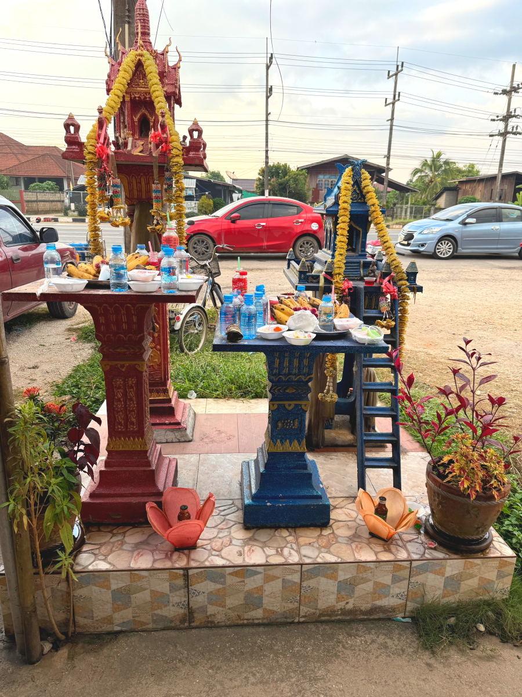

# 20241124_chiangrai

<html>
<head>

<meta charset="UTF-8">
<meta http-equiv="Content-Type" content="text/html; charset=UTF-8">
<meta http-equiv="X-UA-Compatible" content="IE=EmulateIE10" />
<meta http-equiv="X-UA-Compatible" content="IE=edge">

<!--ここから上はお決まりの定型文です-->

<!--ここからが表現の書式などを決めるcssという部分-->

<link href="https://cdnjs.cloudflare.com/ajax/libs/lightbox2/2.7.1/css/lightbox.css" rel="stylesheet">

</head>

<body>

モバイル端末をお使いの場合は、画面を横向きにすると
より見やすくご覧頂けます。

<!--ここ上は、ほぼそのまま使います！-->

<!--QRコードの挿入例-->

 アクセス用QRコード

<marquee direction="left" scrollamount="20" width="30%">(^_^)/~alis</marquee>

<!--流れ文字の挿入例-->
<h1><marquee behavior="left">!!! 2024/11/24 、チェンライ3日目は, 朝市で朝ごはん調達、午後は親戚のお葬式の続き !!!</marquee></h1>

<!--上段にパンクズリストを入れる時の例-->

<a href="https://torokoid.github.io/20241120_bangkok/" target="_blank">2024年11月20日、宇都宮からバンコクに移動</a>><a href="https://torokoid.github.io/20241121_bangkok/" target="_blank">11月21日バンコク市内をうろうろ</a>><a href="https://torokoid.github.io/20241122_chiangrai/" target="_blank">11月22日バンコク市内をうろついてからChaing Raiに移動</a>><a href="https://torokoid.github.io/20241123_chiangrai/" target="_blank">11月23日チェンライのショッピンセンターでお買い物して、午後は親戚のお葬式</a>><a>2024/11/24 、チェンライ3日目は, 朝市で朝ごはん調達</a>

                          

<!--ここから下が、本体部分-->

<h2>朝市の活気は昔の日本と同じかも？</h2>

  

   

   

   

         

  

      

<!--本体はここまで-->

<!--画面に空白地帯を作って、背景が見えるようにしています-->
                                              

<!-- フッタ -->
<footer>

Copyright 2024/11/24 alis @ChiangRai

</footer>

<!--HPにさまざまなJavaScriptを呼び込むための書式-->

